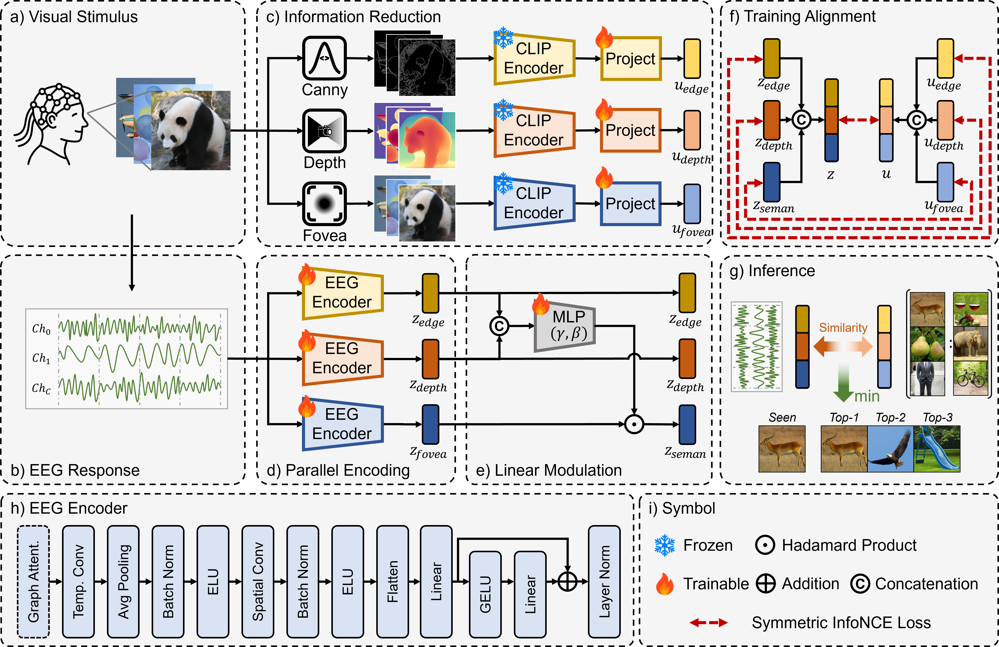

# SAIR: Structural-Semantic Aware Information Reduction for Asymmetric EEG-Visual Alignment

> ⭐ Accepted by MICCAI 2026 as an Oral Presentation

[](PAPER_LINK_PLACEHOLDER)
[](https://github.com/ThomasHC5/SAIR)
[](https://huggingface.co/datasets/thomashc/SAIR)
[](LICENSE)
<!-- TODO: Replace the paper placeholder links after release. -->

SAIR addresses the information asymmetry between dense visual stimuli and sparse EEG signals. It reduces visual redundancy with three neuroscience-inspired transformations—edge extraction, depth estimation, and foveal blurring—and aligns the resulting representations with parallel EEG encoders using structure-guided FiLM fusion and a hierarchical contrastive objective.



## Main Results

SAIR is evaluated on THINGS-EEG2 under intra-subject and leave-one-subject-out (LOSO) protocols.

| Setting | Top-1 Accuracy | Top-5 Accuracy |
| --- | ---: | ---: |
| Intra-subject | **66.9%** | **92.7%** |
| Inter-subject (LOSO) | **17.5%** | **44.1%** |

Compared with ATS, SAIR improves Top-1 accuracy by 8.8 absolute percentage points in the intra-subject setting and by 3.8 points in the inter-subject setting.

## Repository Structure

```text
SAIR/
├── Data/
│   └── Things-EEG2/
│       ├── Raw_data/                 # Raw EEG recordings
│       ├── Preprocessed_data_250Hz/  # Preprocessed 250 Hz EEG signals
│       ├── Image_set/
│       │   ├── image_set/            # Original visual stimuli
│       │   ├── edge_set/             # Edge images
│       │   ├── depth_set/            # Depth images
│       │   └── blur_set/             # Foveally blurred images
│       ├── Features_all/             # Per-image intermediate features
│       └── Features/                 # Merged image features used for training
├── dataset/                          # Dataset loading code
│   ├── eegdataset_intra_sub.py
│   └── eegdataset_loso.py
├── processing_eeg/                   # Code for EEG preprocessing
├── processing_image/                 # Code for image reduction and feature extraction
├── model/                            # Saved checkpoints
├── result/                           # Released logs, metrics, and retrieval results
├── scripts/                          # Shell scripts
│   └── preprocess_images.sh          # End-to-end visual preprocessing pipeline
├── environments/                     # Conda environment specifications
│   ├── environment.yml               # Training and feature extraction
│   └── environment_depth.yml         # Depth-map preprocessing
├── main_intra_sub.py                 # Intra-subject training entry point
├── main_loso.py                      # Leave-one-subject-out training entry point
├── LICENSE
├── .gitignore
└── README.md
```

## Environment

### Model training and image feature extraction

The code for model training and most of the image feature extraction was developed in the Conda environment summarized below. Key packages include:

```text
Python              3.10.19
PyTorch             2.9.1+cu128
torchvision         0.24.1
torch-geometric     2.7.0
einops              0.8.1
open-clip-torch     3.2.0
timm                 1.0.22
NumPy               2.2.6
SciPy               1.15.3
pandas               2.3.3
```

An exported environment specification is provided in [`environment.yml`](environments/environment.yml). Create and activate the environment with:

```bash
conda env create -f environments/environment.yml
conda activate sair
```

### Depth-map preprocessing

Depth maps were generated using the official Depth Anything V2 implementation. The corresponding environment is provided in [`environment_depth.yml`](environments/environment_depth.yml). Create and activate it with:

```bash
conda env create -f environments/environment_depth.yml
conda activate sair-depth
```

### EEG preprocessing

EEG preprocessing follows the NICE pipeline and depends on MNE, NumPy, SciPy, scikit-learn, and tqdm. Due to a server accident, the original EEG preprocessing environment is no longer available. To facilitate reproduction, the preprocessed EEG data is provided on Hugging Face.

## Data Preparation

For faster and easier reproduction, we recommend downloading the prepared data from Hugging Face (Option 1).

### Option 1: Download the prepared data

The preprocessed EEG data and merged CLIP image features required for training are available on Hugging Face. Only `Preprocessed_data_250Hz/` and `Features/` are required when using Option 1.

The Hugging Face release also includes the optional intermediate artifacts `Image_set/edge_set/`, `Image_set/depth_set/`, `Image_set/blur_set/`, and `Features_all/` for inspection or reuse; these files are not required to train or evaluate the model with Option 1.

After downloading, the EEG data and features should have the following layout:

```text
Data/Things-EEG2/
├── Preprocessed_data_250Hz/
│   ├── sub-01/
│   │   ├── preprocessed_eeg_training.npy
│   │   └── preprocessed_eeg_test.npy
│   ├── ...
│   └── sub-10/
│       ├── preprocessed_eeg_training.npy
│       └── preprocessed_eeg_test.npy
└── Features/
    ├── edge_training.npy
    ├── edge_test.npy
    ├── depth_training.npy
    ├── depth_test.npy
    ├── blur_training.npy
    └── blur_test.npy
```

### Option 2: Reproduce the preprocessing pipeline

#### 1. Download the original data

Download **Raw EEG data** and **Image Set** from the official [THINGS-EEG2 OSF project](https://osf.io/3jk45/). Extract the Raw EEG data into `Data/Things-EEG2/Raw_data/` and the Image Set into `Data/Things-EEG2/Image_set/image_set/`, preserving their internal directory structures.

```text
Data/Things-EEG2/
├── Raw_data/
└── Image_set/
    └── image_set/
        ├── training_images/
        └── test_images/
```

#### 2. EEG preprocessing

The preprocessing follows the standard NICE pipeline: channel selection, epoching, baseline correction, downsampling to 250 Hz, trial sorting, and multivariate noise normalization (MVNN). This step takes approximately 3 hours.

Run one subject at a time:

```bash
python processing_eeg/preprocessing.py \
  --sub 1 \
  --n_ses 4 \
  --sfreq 250 \
  --mvnn_dim epochs \
  --project_dir ./Data/Things-EEG2/
```

Repeat `--sub` from 1 to 10.

#### 3. Visual preprocessing and image feature extraction

The end-to-end script generates edge, depth, and foveally blurred images, extracts 1,024-dimensional features with the frozen CLIP ResNet-50 encoder, and merges the per-image arrays into six files under `Data/Things-EEG2/Features/`.

Before running the script, manually download the [Depth Anything V2 ViT-L checkpoint](https://huggingface.co/depth-anything/Depth-Anything-V2-Large/resolve/main/depth_anything_v2_vitl.pth?download=true) and place it at:

```text
processing_image/checkpoints/depth_anything_v2_vitl.pth
```

Run the image preprocessing script; this step may take more than 2 hours. Depth estimation requires a GPU on `cuda:0`.

```bash
bash scripts/preprocess_images.sh
```

## Training and Evaluation

### Provided models and logs

The pretrained intra-subject checkpoints for seed 0 and all 10 subjects are available on [Hugging Face](https://huggingface.co/datasets/thomashc/SAIR). Download and extract them into the repository's `model/` directory, preserving the `model/intra/seed0/` structure, for reuse and further analysis. We will also provide an eval-only script soon.

The `result/` directory in this repository contains the experimental logs and aggregate metrics for the reported runs. For the seed-0 intra-subject experiment, `result/intra/seed0/inference_subject*.txt` provides the test-set Top-5 retrieval results for each subject, including the ranked predictions and correctness indicators used to support the interpretability analyses in our paper.

### Training from Scratch

The paper reports results averaged over five runs with seeds 0–4. Both protocols use Adam with a batch size of 1,000 and a learning rate of `1e-4`; intra-subject training runs for 200 epochs, while leave-one-subject-out training runs for 100 epochs.

#### Intra-subject training

```bash
python main_intra_sub.py \
  --epoch 200 \
  --batch-size 1000 \
  --lr 1e-4 \
  --seed 0 \
  --device cuda:0
```

#### Inter-subject training

The inter-subject experiment follows a leave-one-subject-out protocol. Since the model converges earlier in this setting, 100 training epochs are sufficient.

```bash
python main_loso.py \
  --epoch 100 \
  --batch-size 1000 \
  --lr 1e-4 \
  --seed 0 \
  --device cuda:0
```

To reproduce the reported averages, repeat both protocols with `--seed 0`, `1`, `2`, `3`, and `4`. Each run evaluates all 10 subjects and saves logs and aggregate metrics to `result/<protocol>/seed<seed>/`, while subject-specific checkpoints are saved to `model/<protocol>/seed<seed>/`.

## Acknowledgements

We acknowledge the contribution of the THINGS-EEG2 dataset:

- [A large and rich EEG dataset for modeling human visual object recognition](https://doi.org/10.1016/j.neuroimage.2022.119754)

Our code is built upon or inspired by the following awesome works:


- [Decoding Nature Images from EEG for Object Recognition](https://github.com/eeyhsong/NICE-EEG) [ICLR 2024]
- [Visual Decoding and Reconstruction via EEG Embeddings with Guided Diffusion](https://github.com/dongyangli-del/EEG_Image_decode) [NeurIPS 2024]
- [CognitionCapturer: Decoding Visual Stimuli from Human EEG Signals with Multimodal Information](https://github.com/XiaoZhangYES/CognitionCapturer) [AAAI 2025]
- [Bridging the Vision-Brain Gap with an Uncertainty-Aware Blur Prior](https://github.com/HaitaoWuTJU/Uncertainty-aware-Blur-Prior) [CVPR 2025]
- [Shrinking the Teacher: An Adaptive Teaching Paradigm for Asymmetric EEG-Vision Alignment](https://github.com/LukunWuXDU/ATS) [AAAI 2026]

We acknowledge the following open-source projects:

- [OpenCLIP](https://github.com/mlfoundations/open_clip)
- [Depth Anything V2](https://github.com/DepthAnything/Depth-Anything-V2)

We also acknowledge the following concurrent works, which were not cited in the submitted manuscript:

- [ViEEG: Hierarchical Visual Neural Representation for EEG Brain Decoding](https://github.com/LauMason/ViEEG) [ICML 2026]
- [Leveraging Visual Blur Perception Characteristics for EEG Decoding](https://github.com/makeitperfect/VisualEEGDecoding) [AAAI 2026]
- [NeuroBridge: Bio-Inspired Self-Supervised EEG-to-Image Decoding via Cognitive Priors and Bidirectional Semantic Alignment](https://github.com/feroooooo/NeuroBridge) [AAAI 2026]


## Citation (To Be Update)

If this work is useful for your research, please cite:

```bibtex
@inproceedings{chen2026sair,
  title  = {Structural-Semantic Aware Information Reduction for Asymmetric EEG-Visual Alignment},
  author = {Chen, Hongan and Kong, Yan and Shan, Caifeng and Fang, Yuqi},
  booktitle={International Conference on Medical Image Computing and Computer-Assisted Intervention},
  year = {2026},
  organization={Springer}
}
```

## Contact Us

For any additional questions, please feel free to open an issue or contact us at honganchen@smail.nju.edu.cn.

## License

This project is licensed under the [Apache License 2.0](LICENSE).
